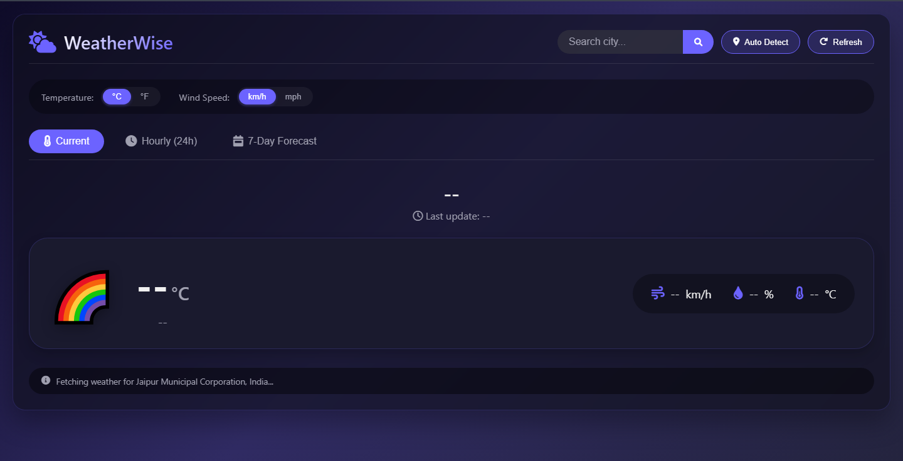
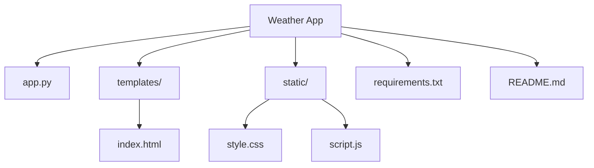

<div align="center">
  
  <h1>🌦️ WeatherWise</h1>
  <p><b>Modern Weather Web App built with Flask.</b></p>

  <p>
    
    
    
    
  </p>

  <br>

  <p><b>Search by city</b> • <b>Auto-detect location</b> • <b>Hourly (24h)</b> • <b>7-Day Forecast</b></p>
</div>

<hr>

## 🌟 Introduction

**WeatherWise** is a clean and responsive weather dashboard. It fetches real-time weather, hourly forecast, and 7-day predictions using the **Open-Meteo API**.

The app also supports:
- **City search** (geocoding via Open-Meteo Geocoding API)
- **Auto-detect location** using browser geolocation, with fallback to IP-based detection
- **Reverse geocoding** to show a friendly location name
- **Temperature (°C/°F)** and **wind speed (km/h ↔ mph)** toggles

---

## 🚀 Features

- ✅ Current weather (temperature, wind, humidity, condition icon)
- ✅ Hourly forecast for the next **24 hours**
- ✅ 7-day forecast with max/min temperatures and wind
- ✅ City search with coordinates
- ✅ Auto-detect location using:
  - Browser Geolocation → Reverse Geocode (Nominatim)
  - Fallback → IP location (ip-api.com)
- ✅ Fully dynamic frontend (no page reloads)
- ✅ Fast Flask JSON API endpoints for frontend rendering

---

## 🛠️ Tech Stack

| Backend | Frontend | External APIs |
| :---: | :---: | :---: |
| <b>Flask</b> (Python) | HTML5 • CSS3 • JavaScript | Open-Meteo Forecast • Open-Meteo Geocoding • OpenStreetMap (Nominatim) • ip-api.com |

---

## ⚙️ Quick Start Guide

### 1️⃣ Clone the repository
```bash
git clone <your-repo-url>
cd Weather
```

### 2️⃣ Create a virtual environment (recommended)
```bash
python -m venv venv
```

### 3️⃣ Activate the environment
**Windows (cmd):**
```bash
venv\Scripts\activate
```

### 4️⃣ Install dependencies
```bash
pip install -r requirements.txt
```

### 5️⃣ Run the server
```bash
python app.py
```

### 6️⃣ Open the app
👉 http://localhost:5000

---

## 📂 Project Structure



---

## 🔧 Backend API Endpoints

- **GET /**
  - Serves the main UI.

- **GET /api/weather?lat=..&lon=..**
  - Returns current weather + hourly + daily forecast in JSON.

- **GET /api/search?city=CityName**
  - Returns latitude/longitude for a given city.

- **GET /api/ip-location**
  - Returns approximate location from IP.

- **GET /api/reverse-geocode?lat=..&lon=..**
  - Returns a readable location name from coordinates.

---

## 🧠 How it works (high level)

1. Frontend gets coordinates (search or auto-detect).
2. Frontend calls `/api/weather` with `lat` and `lon`.
3. Flask fetches forecast data from **Open-Meteo**.
4. Flask formats the response (current, hourly, daily).
5. Frontend renders the UI and supports unit toggles.

---

## 📜 License

This project is distributed under the **MIT License**. See `LICENSE` for more information.

---

<div align="center">
  <i>Made with ❤️ for the WeatherWise Team</i>
</div>

