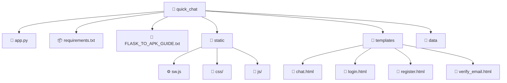

<div align="center">
  
  <h1>✨ Quick Chat ✨</h1>
  <p><b>A modern, feature-rich, and real-time web page and mobile application built with Flask.</b></p>

  <!-- Badges -->
  <p>
    
    
    
    
    
  </p>

  <br>

  **[🌐 Open Web Version](http://sdck.pythonanywhere.com/login)** • **[📱 Download Android App](https://drive.google.com/file/d/15Pah1rSUuOBW4G9yYrRDu521mPSakdV0/view?usp=sharing)**

</div>

<hr>

## 🌟 Introduction

**Quick Chat** is not just another chat app—it's a comprehensive, easy-to-deploy web messenger that requires **zero database configuration**. Powered entirely by local JSON storage and an intuitive Flask backend, Quick Chat gives you everything you need right out of the box.

Whether you're looking to learn web development, host a private server for your friends, or build a scalable PWA (Progressive Web App), Quick Chat is your perfect starting point!

---
## 🚀 Amazing Features

<details>
<summary><b>💬 Real-Time Messaging & Groups</b></summary>
<br>
Enjoy seamless private messaging and create group chats effortlessly. Instant updates without page reloads!
</details>

<details>
<summary><b>🔒 Secure Authentication & OTP Verification</b></summary>
<br>
Full user lifecycle management including Secure Login, Registration, Password Resets, and Email OTP verifications. 
</details>

<details>
<summary><b>📞 Voice/Video Calls & 📸 Stories</b></summary>
<br>
Stay closer with integrated call signaling and share your day with WhatsApp-style disappearing stories!
</details>

<details>
<summary><b>📁 File & Media Sharing</b></summary>
<br>
Share images, documents, and other files up to 50MB directly in your chats.
</details>

<details>
<summary><b>📱 PWA & Offline Support</b></summary>
<br>
Install the app directly on your phone or desktop thanks to the built-in Service Worker. It acts like a native app!
</details>

---

## 🛠️ Tech Stack

| Backend | Frontend | Others |
| :---: | :---: | :---: |
| <br><b>Python</b> | <br><b>HTML5</b> | <br><b>JSON DB</b> |
| <br><b>Flask</b> | <br><b>CSS3</b> | <br><b>PWA/APK Ready</b> |
| <br><b>SMTP Email</b> | <br><b>JavaScript</b> | <br><b>Service Workers</b> |

---

## ⚙️ Quick Start Guide

Ready to get your server running? Just follow these simple steps!

### 1️⃣ Clone the Repository
```bash
git clone <your-repo-url>
cd quick_chat
```

### 2️⃣ Install Dependencies
*It is recommended to use a virtual environment.*
```bash
pip install -r requirements.txt
```

### 3️⃣ Run the Server
```bash
python app.py
```

### 4️⃣ Start Chatting
Open your browser and navigate to:
👉 [**http://localhost:5000**](http://localhost:5000)

---

## 📂 Project Structure



*(Note: The `data` folder is auto-generated upon the first run to store users and messages.)*

---

## 📱 Android App Available!

We have already compiled this web application into a native Android APK for your convenience! 

👉 **[Download the Quick Chat APK here](https://drive.google.com/file/d/15Pah1rSUuOBW4G9yYrRDu521mPSakdV0/view?usp=sharing)**

*(Note: If you want to learn how to convert it yourself, we've included a comprehensive guide. Just check out `FLASK_TO_APK_GUIDE.txt` in the repository for step-by-step instructions.)*

---

## 🤝 Contributing

Contributions make the open source community such an amazing place to learn, inspire, and create. Any contributions you make are **greatly appreciated**.

1. Fork the Project
2. Create your Feature Branch (`git checkout -b feature/AmazingFeature`)
3. Commit your Changes (`git commit -m 'Add some AmazingFeature'`)
4. Push to the Branch (`git push origin feature/AmazingFeature`)
5. Open a Pull Request

---

## 📜 License

Distributed under the MIT License. See `LICENSE` for more information.

---
<div align="center">
  <i>Made with ❤️ by the Quick Chat Team</i>
</div>

